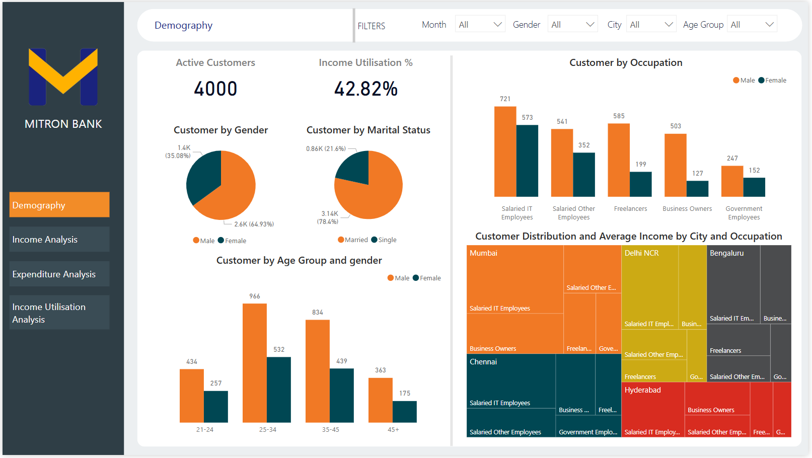

# 🏦 Mitron Bank: Credit Card Expansion Strategy

### 📊 Project Overview
Mitron Bank, a legacy financial institution, is planning to introduce a new line of credit cards to expand its market reach. The strategy director, Mr. Bashnir Rover, requested a pilot analysis of a sample dataset (4,000 customers) to identify key demographics, spending patterns, and income utilization trends.

This dashboard provides data-driven recommendations on which customer segments to target for the new credit card launch.
 
**Tool Used:** Power BI, Power Query, DAX

---

### 📷 Dashboard Preview

| **Demography Page** | 
|:---:|
|  |

---

### 💡 Key Insights & Findings

#### 1. Demographics & Customer Base
* **Total Active Customers:** 4,000 (Sample Set)
* **Gender Distribution:** Male customers (~65%) significantly outnumber Female customers (~35%).
* **Top Location:** **Mumbai** has the highest concentration of high-income customers, followed by Delhi NCR and Bengaluru.
* **Primary Segment:** **Salaried IT Employees** form the largest and most valuable customer base.

#### 2. Income Utilisation (The "Credit Fit" Metric)
* **Overall Average:** The average income utilization is **42.82%**, leaving significant room for credit spending.
* **High Utilisation (Target for Credit):** * **Salaried IT Employees** show the highest utilization (**~51%**), indicating a high propensity to spend and likely need for credit.
    * **Age Group 35-45** records the highest utilization, corresponding to peak family expenses and financial commitments.
* **Low Utilisation (Target for Savings/Investments):**
    * **Government Employees** and **Business Owners** show lower utilization, suggesting a conservative spending approach or wealth reinvestment.

#### 3. Spending Patterns
* **Payment Mode:** High adoption of digital payments among the 21-34 age group.
* **Top Categories:** Significant spend is observed in **Bills, Groceries, and Electronics**, making them ideal categories for "Cashback" or "Reward Point" features.

---

### 🧠 Strategic Recommendations

Based on the data, I recommend tailoring the credit cards into three tiers:

1.  **"Mitron Tech-Life Card" (Premium):**
    * **Target:** Salaried IT Employees & Age 25-45.
    * **Key Feature:** High rewards on Electronics, Dining, and Online Subscriptions.
    * **Rationale:** This group has the highest consistent income utilization.

2.  **"Mitron Saver Card" (Standard):**
    * **Target:** Government Employees & Senior Citizens (45+).
    * **Key Feature:** Cashback on Bills, Groceries, and Medical expenses.
    * **Rationale:** Captures the conservative spenders who prioritize essential savings.

3.  **"Mitron Biz-Grow Card" (Niche):**
    * **Target:** Business Owners & Freelancers.
    * **Key Feature:** Low interest on high-value transactions/EMI options.
    * **Rationale:** Supports variable income streams and business reinvestment.

---

### 🛠️ Technical Implementation
* **Data Modelling:** Star Schema connecting `fact_spends` to `dim_customers`.
* **Advanced DAX:** Created measures for *Income Utilisation %*, *Average Income*, and *Spend Segmentation*.

---

### 📂 File Structure
* [`Mitron_Bank_Dashboard.pbix`](dashboard/Mitron_Bank_Dashboard.pbix): The source Power BI file.
* [`Mitron_Bank_Report.pdf`](dashboard/Mitron_BanK_Report.pdf): A static PDF version of the report.

---
*This project is part of the Codebasics Resume Project Challenge #8.*

👤 Author
Jashwanth Data Analyst | SQL | Python | Power BI

Connect with me on [LinkedIn](https://www.linkedin.com/in/jashwanth-varma-m-b87671208?lipi=urn%3Ali%3Apage%3Ad_flagship3_profile_view_base_contact_details%3B81aE%2FakEQrO%2B7bA3F%2B61IA%3D%3D).

